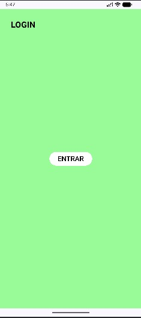
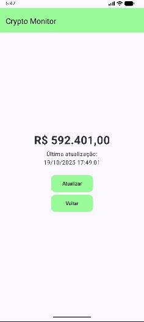
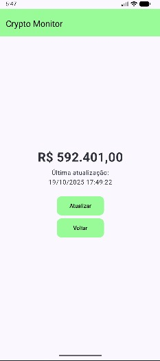
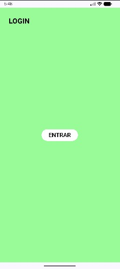

|           Nome             |   RM   |
|----------------------------|--------|
| Guilherme Bezerra Carvalho | 550282 |
| Rodolfo Sanches Cima       | 99748  |
| Felipe Cortez              | 551665 |

# Android Crypto Monitor - Jetpack Compose

Aplicativo Android para monitoramento de criptomoedas em tempo real, desenvolvido com **Kotlin** e **Jetpack Compose**, utilizando o modo declarativo de design.

## 📌 Sobre o Projeto

Este projeto tem como objetivo demonstrar como construir um aplicativo Android de criptomoedas. Ele serve como base para aprendizado para projetos reais relacionados a finanças e ativos digitais.

## ✨ Funcionalidades Principais

- Visualização de criptomoedas com preço e variação
- Atualização de dados em tempo real (via API)
- Interface construída 100% com **Jetpack Compose**
- Navegação por telas usando o *Navigation Component* do Compose
- Arquitetura com *ViewModel* e *State Management*

## 🧱 Arquitetura e Tecnologias

| Componente             | Tecnologia                                |
|------------------------|-------------------------------------------|
| Linguagem              | Kotlin                                    |
| UI Declarativa         | Jetpack Compose                           |
| Gerenciamento de Estado| `mutableStateOf`, `StateFlow`, `ViewModel`|
| Consumo de API         | Retrofit                                  |

## 🚀 Como Executar o Projeto

**1.** Clone o repositório
`git clone https://github.com/Guilherme26BC/android-crypto-monitor-jetpackComposer.git`

**2.** Abra o projeto no Android Studio

**3.**  Sincronize as dependências (Gradle)

**4.** Execute em um dispositivo físico ou emulador

## 🎯 Objetivos do Projeto

- Demonstrar o uso de Jetpack Compose em um caso real de mercado financeiro
- Consumir dados de criptomoedas e exibir de forma reativa
- Criar uma base sólida para evolução do app com novas features

---

## 📱 Screenshots do Aplicativo

| Tela Login | Valor criptomoedas | Após "atualizar" | Após "voltar" |
|--------------|----------------------|-------------------|-------------|
|  |  |  |  |
